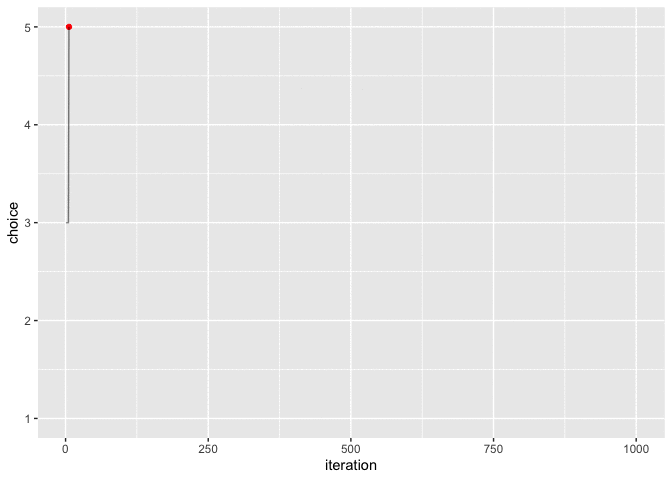

```{r setup}
library(tidyverse)
library(gganimate)
library(magick)
```

```{r}

test <- tibble(
                iteration = 1:50,
                   choice = sample( 1:5, size=50, replace=TRUE )
              )
test
```

```{r}

run_anim <- ggplot( data = test,
                    aes( x = iteration, 
                         y = choice
                       )
                   ) + 
            geom_point() + 
            geom_line() + 
            transition_reveal(iteration)

run_anim
```

# Epsilon Greedy Algorithm

The parameter $\epsilon$ must be chosen by the user. $\epsilon$ controls the proportion of time that the algorithm chooses to **explore** the available options/arms (i.e. collect more information) versus the amount of time that the algorithm will **exploit** the option/arm it has estimated to be the best (i.e. exploit the information collected so far for profit). 

The algorithm is as follows: 

At each iteration:
1. **Exploit** with probability $\epsilon$ i.e. choose the option (arm) currently estimated as the best OR **explore** with probability $1-\epsilon$ i.e. choose an option (arm) at random. 

2. Update the estimates 

```{r fig.width=15, fig.height=5}

epsilon <- 0.05

run_epsilon_greedy <- 
  tibble( iteration = -1,
          choice = -1
        ) %>% 
  slice( 0 )

true_prob_per_lever <- c( 0.1, 0.2, 0.3, 0.4, 0.5 )
n_trials_per_lever <- rep(0, 5)
sum_of_rewards_per_lever <- rep(NA, 5)
avg_reward_per_lever <- rep(NA, 5)

# run each lever once to get initial value estimates:
for( lever_i in 1:5 ){ 
sum_of_rewards_per_lever[lever_i] <- sample( 0:1, 
                                             size = 1, 
                                             prob = c( 1 - true_prob_per_lever[lever_i],
                                                       true_prob_per_lever[lever_i]
                                                     )
                                      )
n_trials_per_lever[lever_i] <- 1
avg_reward_per_lever[lever_i] <- sum_of_rewards_per_lever[lever_i] / n_trials_per_lever[lever_i]
}

for( i in 1:1000 ){
  
  current_best <- max(avg_reward_per_lever) 
  current_best_options <- which( avg_reward_per_lever==current_best )
  explore_options <- setdiff( 1:5, current_best_options )
  
  if( runif(1) > epsilon | length(explore_options)==0 ){
      choice_this_round <- sample( rep(current_best_options,2), size=1)
  } else{
      choice_this_round <- sample( rep(explore_options,2), size=1)
  }
  
  reward <- sample( 0:1, 
                    size = 1, 
                    prob = c( 1 - true_prob_per_lever[choice_this_round],
                              true_prob_per_lever[choice_this_round]
                            )
                  )
  # update value estimates:
  sum_of_rewards_per_lever[choice_this_round] <- sum_of_rewards_per_lever[choice_this_round] + reward 
  n_trials_per_lever[choice_this_round] <- n_trials_per_lever[choice_this_round] + 1
  avg_reward_per_lever[choice_this_round] <- 
        sum_of_rewards_per_lever[choice_this_round] / n_trials_per_lever[choice_this_round]
  
  run_epsilon_greedy <- 
    bind_rows( run_epsilon_greedy
               ,
               tibble( iteration = i,
                          choice = choice_this_round
                     )
               )
}

run_anim <- ggplot( data = run_epsilon_greedy,
                    aes( x = iteration, 
                         y = choice
                       )
                   ) + 
            geom_point( colour = "red" ) + 
            geom_line( alpha=0.5 ) + 
            transition_reveal(iteration) 

anim_save( "epsilon_greedy.gif", 
           run_anim, 
           duration = 10
        )
```



# Epsilon "Cooloff" Algorithm
```{r fig.width=15, fig.height=5}

epsilon <- 0.5

run_epsilon_greedy <- 
  tibble( iteration = -1,
          choice = -1
        ) %>% 
  slice( 0 )

true_prob_per_lever <- c( 0.1, 0.2, 0.3, 0.4, 0.5 )
n_trials_per_lever <- rep(0, 5)
sum_of_rewards_per_lever <- rep(NA, 5)
avg_reward_per_lever <- rep(NA, 5)

# run each lever once to get initial value estimates:
for( lever_i in 1:5 ){ 
sum_of_rewards_per_lever[lever_i] <- sample( 0:1, 
                                             size = 1, 
                                             prob = c( 1 - true_prob_per_lever[lever_i],
                                                       true_prob_per_lever[lever_i]
                                                     )
                                      )
n_trials_per_lever[lever_i] <- 1
avg_reward_per_lever[lever_i] <- sum_of_rewards_per_lever[lever_i] / n_trials_per_lever[lever_i]
}

for( i in 1:1000 ){
  
  current_best <- max(avg_reward_per_lever) 
  current_best_options <- which( avg_reward_per_lever==current_best )
  explore_options <- setdiff( 1:5, current_best_options )
  
  if( runif(1) > epsilon | length(explore_options)==0 ){
      choice_this_round <- sample( rep(current_best_options,2), size=1)
  } else{
      choice_this_round <- sample( rep(explore_options,2), size=1)
  }
  
  reward <- sample( 0:1, 
                    size = 1, 
                    prob = c( 1 - true_prob_per_lever[choice_this_round],
                              true_prob_per_lever[choice_this_round]
                            )
                  )
  # update value estimates:
  sum_of_rewards_per_lever[choice_this_round] <- sum_of_rewards_per_lever[choice_this_round] + reward 
  n_trials_per_lever[choice_this_round] <- n_trials_per_lever[choice_this_round] + 1
  avg_reward_per_lever[choice_this_round] <- 
        sum_of_rewards_per_lever[choice_this_round] / n_trials_per_lever[choice_this_round]
  
  run_epsilon_greedy <- 
    bind_rows( run_epsilon_greedy
               ,
               tibble( iteration = i,
                          choice = choice_this_round
                     )
               )
  if( epsilon > 0.01 ){ epsilon <- epsilon - 0.005 }
}

run_anim <- ggplot( data = run_epsilon_greedy,
                    aes( x = iteration, 
                         y = choice
                       )
                   ) + 
            geom_point( colour = "red" ) + 
            geom_line( alpha=0.5 ) + 
            transition_reveal(iteration) 

anim_save("epsilon_greedy_cooloff.gif", run_anim)
```

# Boltzmann Exploration (Softmax)

For this algorithm, the probability of selecting any given arm $i$ at iteration $t+1$, given collected information at time $t$ is:

$$\begin{array}{lcl} \underset{\text{Prob. of selecting arm } i \text{ at iteration } t+1}{\underbrace{p_i(t+1)}}
&=&
\displaystyle\frac{exp\Big\{\displaystyle\frac{\hat\mu_i(t)}{\tau}\Big\}}{\displaystyle\sum_{j=1}^k exp\Big\{\displaystyle\frac{\hat\mu_i(t)}{\tau}\Big\}}\hspace{20mm} [2] \\
\hat\mu_i(t) &=& \text{estimated value of arm } i \text{ from all information gathered up until iteration } t
\end{array}$$

This probability function causes the algorithm to select arms with higher estimated value ($\hat\mu_i(t)$) more often.  

The *temperature* parameter $\tau$ controls the amount of randomness in the selection decision: $\tau=0$ always selects the arm with highest estimated probability (i.e. the algorithm becomes the *$\epsilon$psilon greedy* algorithm), where as $\tau$ tends to infinity, the algorithm starts selecting between the arms uniformly at random.

Various different selection probabilities for a 3-arm bandit are shown below:

```{r echo=FALSE}
expand_grid( estimated_arm1_value = c(0, 0.1),
             estimated_arm2_value = c(0.1, 0.3),
             estimated_arm3_value = c(0.1, 0.3, 0.8),
             tau = c( 0.002, 0.1, 1, 10)
          ) %>%
  mutate( arm1_numerator = ( exp(estimated_arm1_value/tau) ),
          arm2_numerator = ( exp(estimated_arm2_value/tau) ),
          arm3_numerator = ( exp(estimated_arm3_value/tau) ),
          
          arm1_select_prob = arm1_numerator / (arm1_numerator+arm2_numerator+arm3_numerator),
          arm2_select_prob = arm2_numerator / (arm1_numerator+arm2_numerator+arm3_numerator),
          arm3_select_prob = arm3_numerator / (arm1_numerator+arm2_numerator+arm3_numerator)
        ) %>% 
  
  mutate_all( round, digits=3 ) %>% 
  
  select( tau, 
          estimated_arm1_value,
          estimated_arm2_value,
          estimated_arm3_value,
          
          arm1_select_prob,
          arm2_select_prob,
          arm3_select_prob
        ) %>% 
  
  sample_n(30) %>% 
  
  arrange( tau, estimated_arm1_value, estimated_arm2_value, estimated_arm3_value ) 
```

```{r echo=FALSE}
# Boltzmann Exploration (Softmax) ----------------------------------
tau <- 0.1

algorithm_log <- 
  tibble( iteration = 0,
          choice = NA,
          cr1 = 0,
          cr2 = 0,
          cr3 = 0,
          cr4 = 0,
          cr5 = 0,
          mu1 = 0,   
          mu2 = 0,   
          mu3 = 0,
          mu4 = 0,
          mu5 = 0,
          n1 = 10,
          n2 = 10,
          n3 = 10,
          n4 = 10,
          n5 = 10,
          p1 = 1/5,
          p2 = 1/5,
          p3 = 1/5,
          p4 = 1/5,
          p5 = 1/5
        ) 


for( i in 2:1000 ){ 
  
  # add extra row to table for this iteration:
  algorithm_log <- 
    bind_rows( algorithm_log
               ,
               algorithm_log[i-1,]    # add a blank row to the bottom to populate
              )
  # update iteration number:
  algorithm_log$iteration[i] <- i-1
  
  # get selection probs from previous iteration:
  selection_probs <- unlist( algorithm_log[i-1,c("p1","p2","p3","p4","p5")] )
  
  # choose an arm: 
  algorithm_log$choice[i] <- sample( 1:5, size=1, prob = selection_probs )
  
  # update the count of pulls on this arm:
  algorithm_log[ i, paste0("n",algorithm_log$choice[i]) ] <- algorithm_log[i-1,paste0("n",algorithm_log$choice[i])] + 1 
  
  # update the cumulative reward for this arm:
  algorithm_log[ i, paste0("cr",algorithm_log$choice[i]) ] <-
    algorithm_log[ i-1, paste0("cr",algorithm_log$choice[i]) ] + # previous cumulative reward
            sample( 0:1,
                    size = 1,
                    prob = c( 1 - (algorithm_log$choice[i]/10),
                              (algorithm_log$choice[i]/10) 
                            ) 
                   )
  # update the estimated value of selected arm:
  algorithm_log[ i,paste0("mu",algorithm_log$choice[i]) ] <- 
    algorithm_log[ i,paste0("cr",algorithm_log$choice[i]) ] / algorithm_log[ i,paste0("n",algorithm_log$choice[i]) ] 
  
  # update selection probabilies (based on current value estimates after taking into account choice this round):
  mu_vec <- unlist( algorithm_log[ i, c("mu1","mu2","mu3","mu4","mu5") ] )
  numerators <- exp( mu_vec / tau )  
  updated_probs <- numerators / sum(numerators)
  algorithm_log$p1[ i ] <- updated_probs[1]
  algorithm_log$p2[ i ] <- updated_probs[2]
  algorithm_log$p3[ i ] <- updated_probs[3]
  algorithm_log$p4[ i ] <- updated_probs[4]
  algorithm_log$p5[ i ] <- updated_probs[5]
  
}

```

https://www.cs.mcgill.ca/~vkules/bandits.pdf